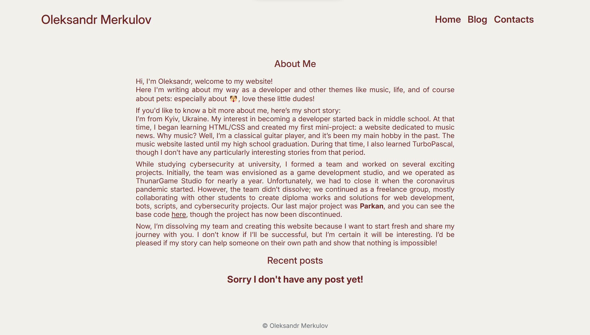
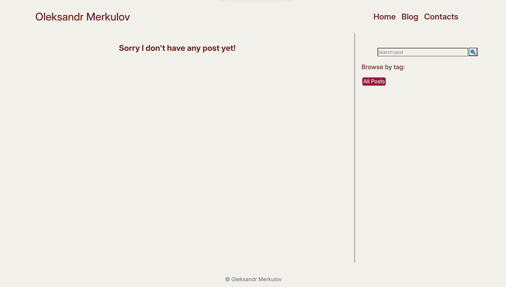
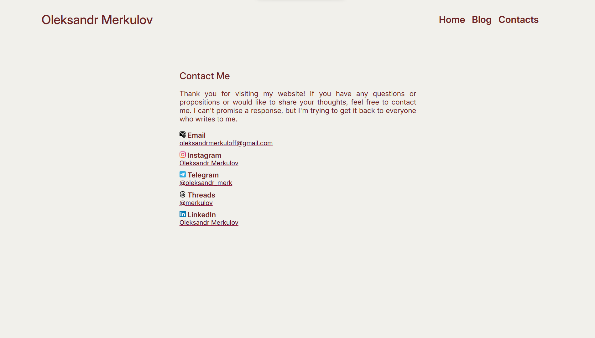

# Personal Website Project

Welcome to the **Personal website** project! This repository contains the source code for personal website.
And every user can to take this code and learn django using it.

## Overview

This project serves as my personal website, showcasing my portfolio, blog, and contact information. It is designed to provide visitors with insights into my work, interests, and ways to connect with me.
But anyone can take this code for learning django features.

## Website includes

- **Home page**: Includes short info about me and last five posts.
- **Blog**: Separate on two sections first and main includes list of posts, second includes search and tag filters.
- **Contact Form**: Allows visitors to contact with me through website.
- **Responsive Design**: Yes, website include it but design isn't great.

## Technologies Used

- **Backend**: [Django](https://www.djangoproject.com/) - A high-level Python web framework.
- **Frontend**: HTML5, CSS3.
- **Database**: PostgreSQL but you can recreat SQLite database.
- **Version Control**: [Git](https://git-scm.com/) and [GitHub](https://github.com/).

### To set up this project locally on your machine, follow these steps

1. **Clone the Repository**: `git clone https://github.com/oleksandrmerkuloff/my-web.git`
2. **Don't forget about python**: https://www.python.org/
3. **Install all tools what you need**: using requirements.txt install all frames and libs `pip install -r /path/to/requirements.txt`

#### After all you can use this website for learning django or maybe create yor own website.

At the end I posted several images from website:

## Home page

## Blog page

## Contacts page

